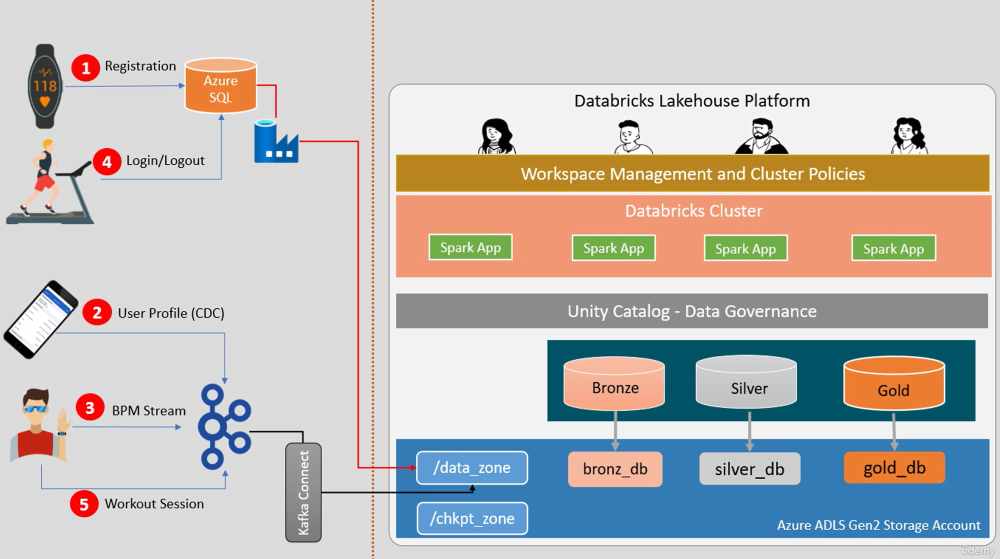

This README provides a comprehensive guide to understanding, setting up, and running the project. It includes details on the architecture, data sources, data ingestion, processing, and CI/CD automation using Azure DevOps.

# Capstone Project: Real-Time Wearable Device Data Processing with Medallion Architecture

## Project Overview

This project implements a real-time data processing platform using the Medallion architecture. It leverages Databricks, Apache Spark, and Azure DevOps to create a robust and scalable data pipeline. The primary objective is to process fitness-related data streams, perform ETL operations, and generate summarized reports for downstream analytics.

## Table of Contents

- [Project Overview](#project-overview)
- [Architecture](#architecture)
- [Data Sources](#data-sources)
- [Project Structure](#project-structure)
- [Setup Instructions](#setup-instructions)
- [Data Ingestion and Processing](#data-ingestion-and-processing)
- [Automation with CI/CD Using Azure DevOps](#automation-with-cicd-using-azure-devops)
- [Running the Project](#running-the-project)
- [Testing](#testing)
- [Use Cases](#use-cases)
- [Contributing](#contributing)

## Architecture

The project follows the Medallion architecture, consisting of three layers: Bronze, Silver, and Gold. Below is a detailed architecture diagram that illustrates the components and data flow within the system.



### Explanation of Architecture

1. **Data Sources**:
   - **Registration and Login/Logout**: Data from fitness devices and applications is ingested into Azure SQL.
   - **User Profile (CDC)**: Change Data Capture (CDC) events for user profile updates are captured and sent to Kafka.
   - **BPM Stream**: Continuous heart rate data streams from devices are sent to Kafka.
   - **Workout Session**: Start and stop events for workout sessions are sent to Kafka.

2. **Data Ingestion**:
   - Data from Azure SQL and Kafka is ingested into the Databricks Lakehouse Platform.

3. **Databricks Lakehouse Platform**:
   - **Workspace Management and Cluster Policies**: Manages user access, workspace configurations, and cluster policies.
   - **Databricks Cluster**: Runs Spark applications for data processing.

4. **Unity Catalog - Data Governance**:
   - Manages fine-grained access control and data governance.

5. **Data Processing Layers**:
   - **Bronze Layer**: Ingests raw data from landing zones into `bronz_db` in the `/data_zone` storage.
   - **Silver Layer**: Cleans and transforms data into `silver_db`.
   - **Gold Layer**: Aggregates and summarizes data into `gold_db` for reporting.

6. **Storage**:
   - **/data_zone**: Stores raw and intermediate data.
   - **/chkpt_zone**: Stores checkpoint data for streaming processes.

## Data Sources

We are using the following data sources for this project:

1. **Registered Users Data (CSV)**: Information about users registering their devices.
2. **User Profile Updates (JSON)**: Change Data Capture (CDC) events for user profile updates.
3. **BPM Stream (JSON)**: Continuous heart rate data streams from devices.
4. **Workout Sessions (JSON)**: Start and stop events for workout sessions.
5. **Login/Logout Events (CSV)**: Records of users logging in and out of the system.
6. **Date Lookup (JSON)**: Pre-prepared 20-year dates dimension according to the company's financial calendar.

## Project Structure

```plaintext
CAPSTONE PROJECT
├── Data Set
│   ├── 1-registered_users_1.csv
│   ├── 1-registered_users_2.csv
│   ├── 2-user_info_1.json
│   ├── 2-user_info_2.json
│   ├── 3-bpm_1.json
│   ├── 3-bpm_2.json
│   ├── 4-workout_1.json
│   ├── 4-workout_2.json
│   ├── 5-gym_logins_1.csv
│   ├── 5-gym_logins_2.csv
│   ├── 6-date-lookup.json
│   ├── 7-gym_summary_1.parquet
│   ├── 7-gym_summary_2.parquet
│   ├── 8-workout_bpm_summary_2.parquet
├── Notebooks
│   ├── 01-config.py
│   ├── 02-setup.py
│   ├── 03-history-loader.py
│   ├── 04-bronze.py
│   ├── 05-silver.py
│   ├── 06-gold.py
│   ├── 07-run.py
│   ├── 08-batch-test.py
│   ├── 09-stream-test.py
│   ├── 10-producer.py
├── Other Code
│   ├── azure_build_pipeline.yaml
│   ├── deploy-notebooks.sh
│   ├── deploy.sh
│   ├── run-integration-test.sh
│   ├── SBIT Deploy Pipeline.json
└── README.md
```

## Setup Instructions

### Prerequisites

1. Azure Subscription
2. Databricks Workspace
3. Azure DevOps Account
4. Git Repository

### Step-by-Step Setup

1. **Create Databricks Workspace**:
    - Go to Azure Portal, search for Databricks, and create a new Databricks service.
    - Launch the workspace and create a cluster.

2. **Setup Storage Layer**:
    - Create Azure ADLS Gen2 storage.
    - Create containers for metadata, managed tables, and unmanaged tables.

3. **Configure Unity Catalog**:
    - Create a Unity Catalog Metastore.
    - Define storage locations and attach them to the Unity Catalog.

4. **Clone Repository and Setup Source Control**:
    - Clone the repository to your local machine.
    - Connect your Databricks workspace with Azure DevOps repository.

5. **Configure Notebooks and Scripts**:
    - Update the configuration in `01-config.py`.
    - Run the setup script `02-setup.py` to initialize databases and tables.

## Data Ingestion and Processing

### Bronze Layer

1. **Data Ingestion**:
    - Ingest raw data from landing zones to the bronze layer tables using `04-bronze.py`.
    - Implement Spark streaming to ensure real-time data processing.

2. **Data Sources**:
    - **User Registration Data**: Ingested from CSV files.
    - **User Profile CDC Data**: Ingested from JSON files.
    - **BPM Stream Data**: Ingested from JSON files.
    - **Workout Sessions Data**: Ingested from JSON files.
    - **Login/Logout Events Data**: Ingested from CSV files.

### Silver Layer

1. **Data Processing**:
    - Clean and transform the data in the silver layer using `05-silver.py`.
    - Remove duplicates, handle CDC, and apply necessary transformations.

2. **Functions**:
    - `Upsert users`: Merges initial device or user registration data.
    - `Upsert gym logs`: Processes gym login/logout events.
    - `Upsert user profile`: Handles user profile updates.
    - `Upsert workouts`: Processes workout session data.
    - `Upsert heart rate`: Processes BPM stream data.
    - `Upsert user bins`: Creates user binning for age groups.
    - `Upsert completed workouts`: Matches workout start and end times.
    - `Upsert workout BPM`: Aggregates workout BPM data.

### Gold Layer

1. **Data Aggregation**:
    - Aggregate and summarize the data for reporting using `06-gold.py`.
    - Create final reports and views for downstream analytics.

2. **Functions**:
    - `Upsert workout BPM summary`: Aggregates workout BPM data for summary reports.

## Automation with CI/CD Using Azure DevOps

### Build Pipeline

1. **Create Yaml File**:
    - Define steps for the build pipeline in `azure_build_pipeline.yaml`.
    - Include tasks for installing Python, checking out the latest code, and creating artifacts.

2. **Steps**:
    - Install Python 3.10.
    - Install necessary Python packages.
    - Checkout the latest code from the repository.
    - Archive the code into a zip file and publish it as an artifact.

3. **Trigger**:
    - Automatically triggered on code commit or pull request to the repository.

### Release Pipeline

1. **Create Release Pipeline**:
    - Define the release pipeline in `SBIT Deploy Pipeline.json`.
    - Configure tasks for extracting artifacts, installing Databricks CLI, and deploying code to Databricks workspace.

2. **Steps**:
    - Use Python 3.10.
    - Extract build artifacts.
    - Install Databricks CLI.
    - Deploy notebooks to Databricks workspace.
    - Run integration tests using the `run-integration-test.sh` script.

3. **Trigger**:
    - Manually triggered for controlled deployments to QA/Production environments.

## Running the Project

1. **Data Ingestion (Bronze Layer)**:
    - Run `04-bronze.py` to ingest data into the Bronze layer.

2. **Data Transformation (Silver Layer)**:
    - Run `05-silver.py` to process and clean data into the Silver layer.

3. **Data Aggregation (Gold Layer)**:
    - Run `06-gold.py` to aggregate and summarize data into the Gold layer.

4. **Orchestration**:
    - Use `07-run.py` to orchestrate the entire data pipeline.


## Testing

### Batch Mode Testing

1. **Initial Setup**:
    - Run `02-setup.py` and `03-history-loader.py` for initial setup.
    
2. **Batch Test**:
    - Use `08-batch-test.py` to validate the batch processing.

### Stream Mode Testing

1. **Initial Setup**:
    - Clean the environment and run `09-stream-test.py` to validate the streaming processing.

2. **Test Data Producer**:
    - Use `10-producer.py` to simulate real-time data ingestion.

## Use Cases

1. **Fitness Data Analysis**:
    - Analyze fitness device data to generate insights on user activities, heart rates, and workout patterns.

2. **User Behavior Tracking**:
    - Track user login/logout activities, workout sessions, and profile updates.

3. **Real-Time Analytics**:
    - Provide real-time analytics and dashboards for fitness tracking and health monitoring.

## Contributing

Contributions are welcome! Please submit a pull request or open an issue to discuss your ideas.

---
